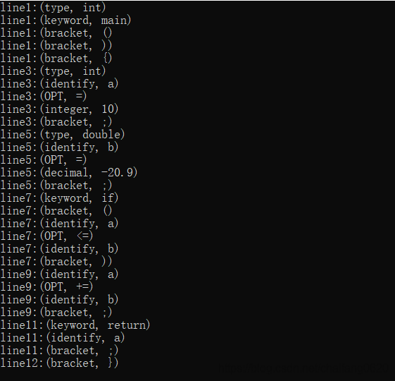

# flex源文件
对源文件进行扫描之后自动生成词法分析函数 int yylex(),并输入到lex.yy.c文件中。
fex的输入文件由3段组成，用一行中只有%%来分隔；
```
定义: definition
%%
规则: rules
%%
用户代码：code
```

## 定义部分（其中定义有变量声明，正则表达式声明）：
   ### 变量声明
   同c ++
   ### 表达式声明
   ```
   表达式名称+表达式
   ```

## 规则部分
   一个规则一行，格式为
   ```
   正则表达式{动作函数}
   ```
   下面是两个例子：
   ```
   %{
	#include<stdio.h>
	#include<stdlib.h>
	int line=1;
%}

DIGIT [0-9]
OINTEGER [1-9]{DIGIT}*

%%
\n {++line;}
{DIGIT} {printf("line%d:(integer, %s)\n",line,yytext);} 
{OINTEGER} {printf("line%d:(integer, %s)\n",line,yytext);} 
. {}
[ \t]+ {}

%%
int main(){
	yyin=fopen("F:/data.txt","r");
	yylex();
	return 0;
}
int yywrap(){
	return 1;
}

```
```
%{
	#include<stdio.h>
	#include<stdlib.h>
	#include<string.h>
	int line=1;
%}
LETTER [a-zA-Z]
ID ({LETTER}|_)({LETTER}|_|{DIGIT})* 
OPT ("+"|"-"|"*"|"/"|"+="|"-="|"*="|"/="|">="|"<="|"=="|">"|"<"|"="|"++"|"--") 
BRACKET ("("|")"|"["|"]"|"{"|"}"|";"|","|"\'"|"\""|"#") 
DIGIT [0-9]
OINTEGER [1-9]{DIGIT}*
INTEGER ("+"|"-")?{OINTEGER}
DECIMAL {INTEGER}(.{OINTEGER})
FLOAT ([0-9])*+[.]([0-9])*+[Ee]([+-]?[0-9]([0-9])*|[0])
ERROEFLOAT ([0-9])*+[.](0-9)*+("E"|"e")
TYPE void|int|double|char
KEYWORD if|else|do|while|for|scanf|printf|sqrt|abs|main|return|float
TYPEIDENTIFY %d|%c|%s|%f|&{ID}
SGPS \/\/.*
DBPS \/\*(.|\n)*\*\/ 

%%
\n {++line;}
{TYPE} {printf("line%d:(type, %s)\n",line,yytext);}
{KEYWORD} {printf("line%d:(keyword, %s)\n",line,yytext);}
{DIGIT} {printf("line%d:(integer, %s)\n",line,yytext);} 
{OINTEGER} {printf("line%d:(integer, %s)\n",line,yytext);} 
{ID} {printf("line%d:(identify, %s)\n",line,yytext);} 
{BRACKET} {printf("line%d:(bracket, %s)\n",line,yytext);} 
{OPT} {printf("line%d:(OPT, %s)\n",line,yytext);}
{INTEGER} {printf("line%d:(integer, %s)\n",line,yytext);}
{DECIMAL} {printf("line%d:(decimal, %s)\n",line,yytext);}
{FLOAT} {printf("line%d:(float, %s)\n",line,yytext);}
{TYPEIDENTIFY} {printf("line%d:(typeidentify, %s)\n",line,yytext);}
{ERROEFLOAT} {printf("ERROEFLOAT\n");}
({SGPS}|{DBPS}) {}
. {}
[ \t]+ {}

%%
int main(){
	yyin=fopen("F:/data.txt","r");
	yylex();
	return 0;
}
int yywrap(){
	return 1;
}

```
测试用例如下：
```
int main(){

    int a = 10;

    double b = -20.9;

    if(a<=b)        

    a+=b;

    return a;
}
```
测试结果如下：
   
